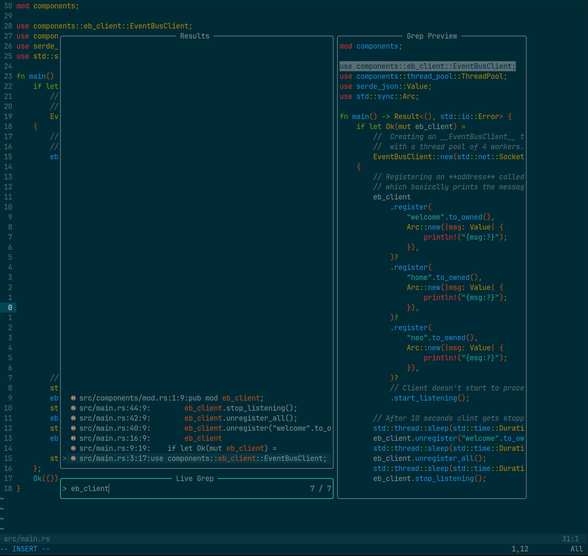

# ⚙️ dotfiles

set deez dots

## About **dotfiles** script

I'm trying to convert my entire development setup from bash scripts to ansible progressively. This file serves as a
starting point for the further automation with ansible playbooks. If you want to learn about the details checkout:

- [TheAltF4Stream's great video](https://www.youtube.com/watch?v=V_Cj_p6se3k)

## 📜 About .sh files

I'm configuring and keeping my setups updated through .sh files.

### dot.sh

This is for updating and setting up the local configuration files of following programs:

- zsh
- tmux
- NeoVim

## 🗔 About NeoVim

Although I'm still a dummy when it comes to **vim**, I configured this setup by myself. It is **very very simplistic** and serves
enough features. It is entirely lua based.There are couple of links that I want to share which also influenced
this configuration:

- [devaslife's NeoVim setup video](https://www.youtube.com/watch?v=ajmK0ZNcM4Q)
- [devaslife's NeoVim setup article](https://blog.inkdrop.app/my-neovim-setup-for-react-typescript-tailwind-css-etc-in-2022-a7405862c9a4)
- [chris@machine's NeoVim IDE from Scratch series](https://www.youtube.com/watch?v=ctH-a-1eUME&list=PLhoH5vyxr6Qq41NFL4GvhFp-WLd5xzIzZ)

### Some features that I currently use

I use **packer** for plugin management.

- Completion
- LSP (tsserver, rust-analyzer, lua_ls, cssls)
  - mason
  - lspconfig
  - lspkind
  - null-ls
- Git
  - gitsigns
  - git
- Treesitter
- Telescope
- Neosolarized colorscheme _Solarized Dark theme_
- Other
  - autopairs _Pair Brackets_
  - autotag _Pair Html tags_
  - bufferline _Tabs like buffers_
  - toggleterm _Floating Terminal_
  - lualine _Status Line_
  - nvim-comment _Comment Toggler_

### Screenshots




## 🪟 About tmux with NeoVim conflict

I don't know why, but I spent too much time to support RGB colors in NeoVim inside a tmux session. Following line that
should reside in your `.tmux.conf` file was the answer for me.

```
set-option -s terminal-features ",*256col*:RGB"
```
